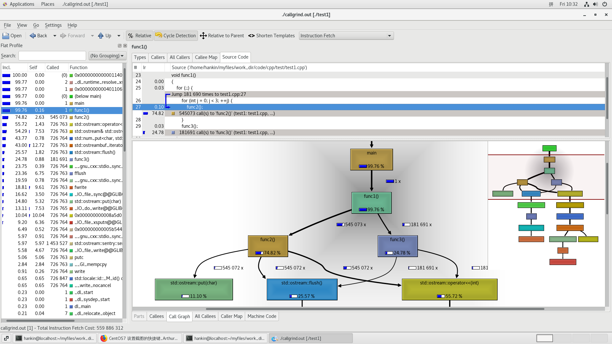

# Program profiling
In this article, we describe how to use code profilers to identify performance bottlenecks.

## Example code
```c++
#include <iostream>
using namespace std;
void func2()
{
    static int i = 0;
    cout << ++i << endl;
}
void func3()
{
    static int i = 0;
    cout << ++i << endl;
}
void func1()
{
    for (;;) {
        for (int j = 0; j < 3; ++j) {
            func2();
        }
        func3();
    }
}
int main()
{
    func1();
    return 0;
}
```
Operating System : Linux  
Gcc Version : 9.3.1  
Compile Command : g++ test.cpp -o test -O2 -g  
## valgrind + kcachegrind  
The first tool is valgrind, let us use valgrind to profile our code which is shown above.  
Step 1: Run program using valgrind  
        Instruction: valgrind --tool=callgrind --trace-children=yes --dump-instr=yes --collect-jumps=yes --collect-systime=no --branch-sim=yes --simulate-cache=yes ./test >/dev/null 2>&1  
Step 2: After running for 10 seconds, use CTRL + C to exit this program. Now you can find a callgrind.out file in your working directory. For example:   
             [hankin@localhost test]$ ls  
             callgrind.out.115774  test  test.cpp  
Step 3: Use kcachegrind to open and analyze this profile file.  
        Instruction: kcachegrind  
  

